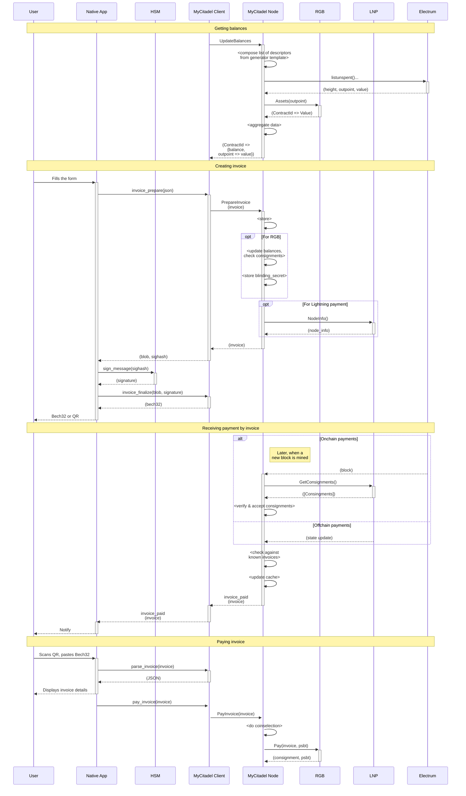

```mermaid
sequenceDiagram

participant User
participant App as Native App
participant HSM
participant Client as MyCitadel Client
participant Node as MyCitadel Node
participant RGB
participant LNP
participant Electrum


Note over User, Electrum: Getting balances

Client ->> +Node: UpdateBalances
Node ->> Node: <compose list of descriptors<br> from generator template>
Node ->> +Electrum: listunspent()...
Electrum -->> -Node: (height, outpoint, value)
Node ->> +RGB: Assets(outpoint)
RGB -->> -Node: (ContractId => Value)
Node ->> Node: <aggregate data>
Node -->> -Client: (ContractId => <br> {balance,<br>outpoint => value})


Note over User, Electrum: Creating invoice

User ->> +App: Fills the form
App ->> +Client: invoice_prepare(json)
Client ->> +Node: PrepareInvoice<br>(invoice)
Node ->> Node: <store>
opt For RGB
    Node ->> Node: <update balances,<br>check consignments>
    Node ->> Node: <store blinding_secret>
end
opt For Lightning payment
    Node ->> +LNP: NodeInfo()
    LNP -->> -Node: (node_info)
end
Node -->> -Client: (invoice)
Client -->> -App: (blob, sighash)
App ->> +HSM: sign_message(sighash)
HSM -->> -App: (signature)
App ->> +Client: invoice_finalize(blob, signature)
Client -->> -App: (bech32)
App -->> -User: Bech32 or QR

Note over User, Electrum: Receiving payment by invoice

alt Onchain payments
    Note right of Node: Later, when a<br>new block is mined
    Electrum -->> +Node: (block)
    Node ->> +LNP: GetConsignments()
    LNP -->> -Node: ([Consingments])
    Node ->> Node: <verify & accept consignments>
else Offchain payments
    LNP -->> Node: (state update)
end
Node ->> Node: <check against<br>known invoices>
Node ->> Node: <update cache>
Node -->> -Client: invoice_paid<br>(invoice)
activate Client
Client -->> -App: invoice_paid<br>(invoice)
activate App
App -->> -User: Notify


Note over User, Electrum: Paying invoice

User ->> +App: Scans QR, pastes Bech32
App ->> +Client: parse_invoice(invoice)
Client -->> -App: (JSON)
App -->> -User: Displays invoice details

App ->> +Client: pay_invoice(invoice)
Client ->> +Node: PayInvoice(invoice)
Node ->> Node: <do coinselection>
Node ->> +RGB: Pay(invoice, psbt)
RGB -->> -Node: (consignment, psbt)

```
