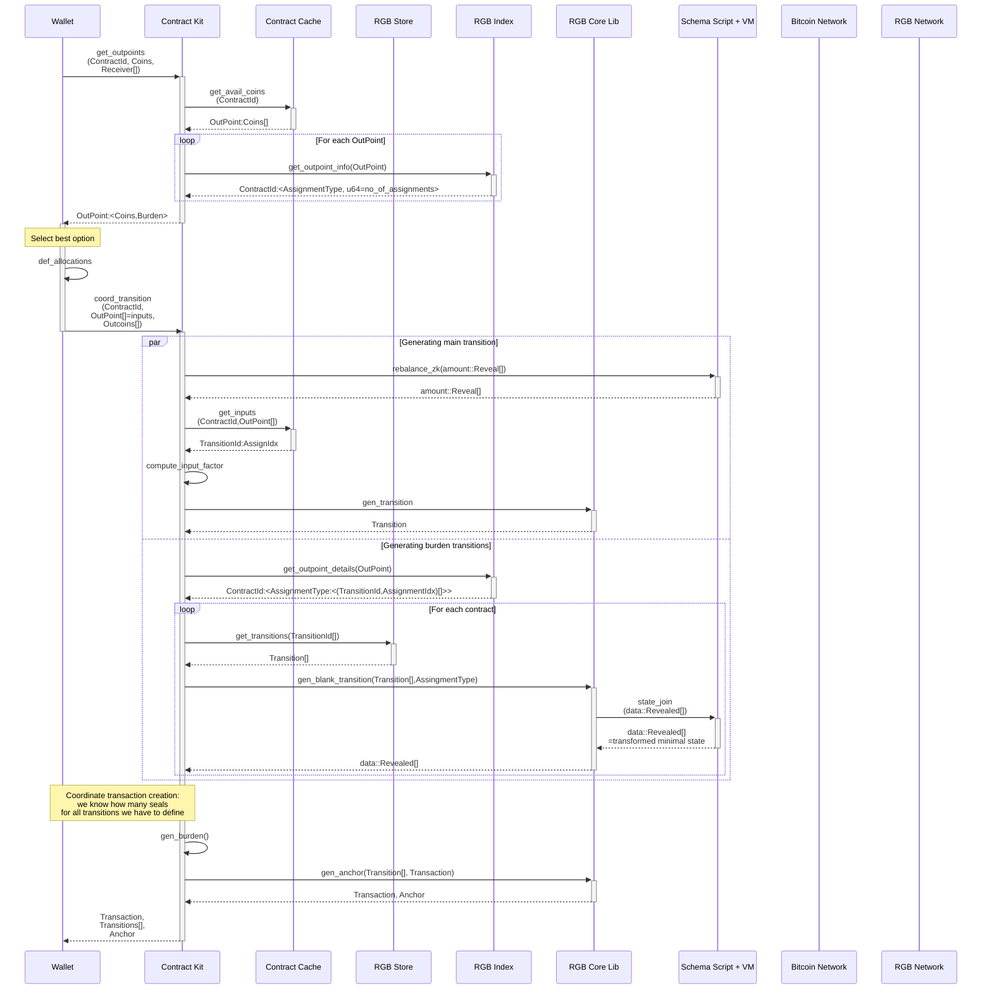

```mermaid
sequenceDiagram
    participant W as Wallet
    participant Kit as Contract Kit
    participant Cache as Contract Cache
    participant Store as RGB Store
    participant Index as RGB Index
    participant Core as RGB Core Lib
    participant VM as Schema Script + VM
    participant BN as Bitcoin Network
    participant RN as RGB Network

    W->>+Kit: get_outpoints<br>(ContractId, Coins, <br>Receiver[])
    Kit->>+Cache: get_avail_coins<br>(ContractId)
    Cache-->>-Kit: OutPoint:Coins[]
    loop For each OutPoint
        Kit->>+Index: get_outpoint_info(OutPoint)
        Index-->>-Kit: ContractId:<AssignmentType, u64=no_of_assignments>
    end
    Kit-->>-W: OutPoint:<Coins,Burden>

    activate W
    Note over W: Select best option
    W->>W: def_allocations
    W->>-Kit: coord_transition<br>(ContractId,<br>OutPoint[]=inputs,<br>Outcoins[])

    activate Kit
    par Generating main transition
        Kit->>+VM: rebalance_zk(amount::Reveal[])
        VM-->>-Kit: amount::Reveal[]
        Kit->>+Cache: get_inputs<br>(ContractId,OutPoint[])
        Cache-->>-Kit: TransitionId:AssignIdx
        Kit->>Kit: compute_input_factor
        Kit->>+Core: gen_transition
        Core-->>-Kit: Transition
    and Generating burden transitions
        Kit->>+Index: get_outpoint_details(OutPoint)
        Index-->>-Kit: ContractId:<AssignmentType:<(TransitionId,AssignmentIdx)[]>>
        loop For each contract
            Kit->>+Store: get_transitions(TransitionId[])
            Store-->>-Kit: Transition[]
            Kit->>+Core: gen_blank_transition(Transition[],AssingmentType)
            Core->>+VM: state_join<br>(data::Revealed[])
            VM-->>-Core: data::Revealed[]<br>=transformed minimal state
            Core-->>-Kit: data::Revealed[]
        end
    end

    Note over W, Kit: Coordinate transaction creation:<br>we know how many seals <br>for all transitions we have to define

    Kit->>Kit: gen_burden()
    Kit->>+Core: gen_anchor(Transition[], Transaction)
    Core-->>-Kit: Transaction, Anchor
    Kit-->>W: Transaction,<br>Transitions[],<br>Anchor

    deactivate Kit
```
