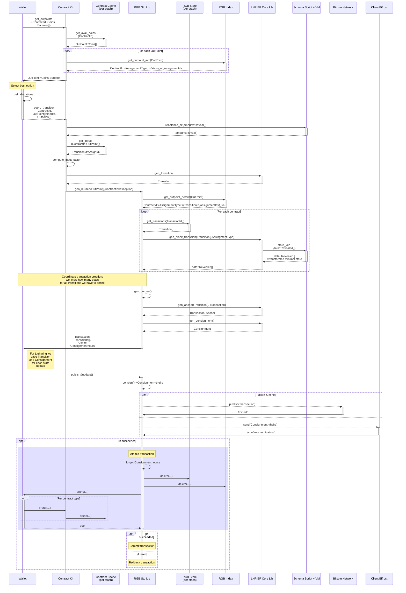

```mermaid
sequenceDiagram
    participant W as Wallet
    participant Kit as Contract Kit
    participant Cache as Contract Cache<br>(per stash)
    participant RGB as RGB Std Lib
    participant Store as RGB Store<br>(per stash)
    participant Index as RGB Index
    participant Core as LNP/BP Core Lib
    participant VM as Schema Script + VM
    participant BN as Bitcoin Network
    participant RN as Client/Bifrost

    W->>+Kit: get_outpoints<br>(ContractId, Coins, <br>Receiver[])
    Kit->>+Cache: get_avail_coins<br>(ContractId)
    Cache-->>-Kit: OutPoint:Coins[]
    loop For each OutPoint
        Kit->>+Index: get_outpoint_info(OutPoint)
        Index-->>-Kit: ContractId:<AssignmentType, u64=no_of_assignments>
    end
    Kit-->>-W: OutPoint:<Coins,Burden>

    activate W
    Note over W: Select best option
    W->>W: def_allocations
    W-->>-Kit: coord_transition<br>(ContractId,<br>OutPoint[]=inputs,<br>Outcoins[])

    activate Kit
    Kit->>+VM: rebalance_zk(amount::Reveal[])
    VM-->>-Kit: amount::Reveal[]
    Kit->>+Cache: get_inputs<br>(ContractId,OutPoint[])
    Cache-->>-Kit: TransitionId:AssignIdx
    Kit->>Kit: compute_input_factor
    Kit->>+Core: gen_transition
    Core-->>-Kit: Transition

    Kit->>-RGB: gen_burden(OutPoint[],ContractId=exception)
    activate RGB
    RGB->>+Index: get_outpoint_details(OutPoint)
    Index-->>-RGB: ContractId:<AssignmentType:<(TransitionId,AssignmentIdx)[]>>
    loop For each contract
        RGB->>+Store: get_transitions(TransitionId[])
        Store-->>-RGB: Transition[]
        RGB->>+Core: gen_blank_transition(Transition[],AssingmentType)
        Core->>+VM: state_join<br>(data::Revealed[])
        VM-->>-Core: data::Revealed[]<br>=transformed minimal state
        Core-->>-RGB: data::Revealed[]
    end

    Note over W, RGB: Coordinate transaction creation:<br>we know how many seals <br>for all transitions we have to define

    RGB->>RGB: gen_burden()
    RGB->>+Core: gen_anchor(Transition[], Transaction)
    Core-->>-RGB: Transaction, Anchor
    RGB->>+Core: gen_consignment()
    Core-->>-RGB: Consignment
    RGB->>+W: Transaction,<br>Transitions[],<br>Anchor,<br>Consignment=ours
    deactivate RGB

    Note right of W: For Lightning we<br>save Transition<br> and Consignment<br> for each state<br>update

    W-->>+RGB: publish&update()
    RGB->>RGB: consign()->Consignment=theirs
    par Publish & mine
        RGB-->>+BN: publish(Transaction)
        BN->>-RGB: /mined/
    and
        RGB-->>+RN: send(Consignment=theirs)
        RN->>-RGB: /confirms verification/
    end

    opt if succeeded
        rect rgba(225,225,255)
            Note over RGB: Atomic transaction
            RGB->>+RGB: forget(Consignment=ours)
            RGB->>Store: delete(...)
            RGB->>Index: delete(...)
            RGB->>+W: prune(...)
            loop Per contract type
                W->>Kit: prune(...)
                Kit->>Cache: prune(...)
            end
            W-->>-RGB: bool
            deactivate RGB
        end
        alt If succeeded
            Note over RGB: Commit transaction
        else if failed
            Note over RGB: Rollback transaction
        end
    end

    deactivate RGB

```
