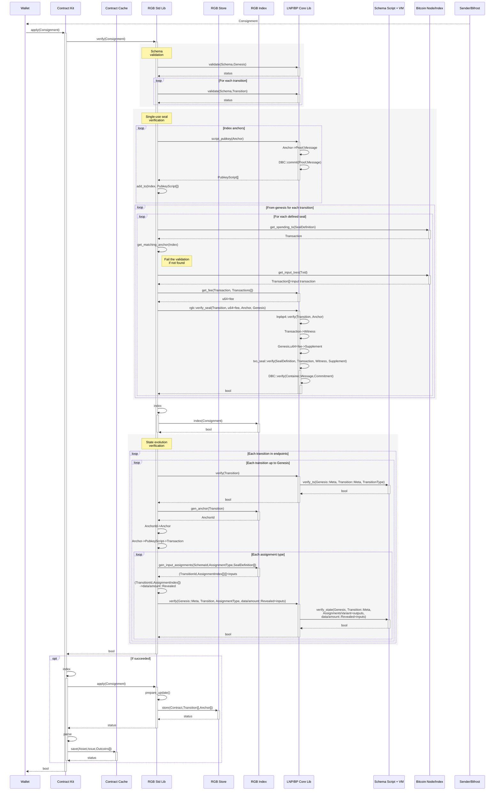

```mermaid
sequenceDiagram
    participant W as Wallet
    participant Kit as Contract Kit
    participant Cache as Contract Cache
    participant RGB as RGB Std Lib
    participant Store as RGB Store
    participant Index as RGB Index
    participant Core as LNP/BP Core Lib
    participant VM as Schema Script + VM
    participant BN as Bitcoin Node/Index
    participant RN as Sender/Bifrost

    RN-->>+W: Consignment
    W->>+Kit: apply(Consignment)
    Kit->>+RGB: verify(Consignment)

    rect rgba(245,245,245)
        Note over RGB: Schema<br>validation
        RGB->>+Core: validate(Schema,Genesis)
        Core-->>-RGB: status
        loop For each transition
            RGB->>+Core: validate(Schema,Transition)
            Core-->>-RGB: status
        end
    end

    rect rgba(245,245,245)
        Note over RGB: Single-use seal<br>verification
        loop Index anchors
            RGB->>+Core: script_pubkey(Anchor)
            Core->>Core: Anchor->Proof,Message
            Core->>Core: DBC::commit(Proof,Message) # At ScriptPubKey level, gen all output encoding variants
            Core-->>-RGB: PubkeyScript[]
            RGB->>RGB: add_to(Index, PubkeyScript[])
        end
        loop From genesis for each transition
            loop For each defined seal
                RGB->>+BN: get_spending_tx(SealDefinition)
                BN-->>-RGB: Transaction
                RGB->>RGB: get_matching_anchor(Index)
                Note right of RGB: Fail the validation<br>if not found

                RGB->>+BN: get_input_txes(Txid)
                BN-->>-RGB: Transaction[]=input transaction
                RGB->>+Core: get_fee(Transaction, Transactions[])
                Core-->>-RGB: u64=fee

                RGB->>+Core: rgb::verify_seal(Transition, u64=fee, Anchor, Genesis)
                Core->>Core: lnpbp4::verify(Transition, Anchor)
                Core->>Core: Transaction->Witness
                Core->>Core: Genesis,u64=fee->Supplement
                Core->>+Core: txo_seal::verify(SealDefinition, Transaction, Witness, Supplement)
                Core->>+Core: DBC::verify(Container,Message,Commitment)
                Core-->>-RGB: bool
                deactivate Core
                deactivate Core
            end
        end
    end

    RGB->>+RGB: index
    RGB->>+Index: index(Consignment)
    Index-->>-RGB: bool
    deactivate RGB

    rect rgba(245,245,245)
        Note over RGB: State evolution<br>verification
        loop Each transition in endpoints
            loop Each transition up to Genesis
                RGB->>+Core: verify(Transition)
                Core->>+VM: verify_ts(Genesis::Meta, Transition::Meta, TransitionType)
                VM-->>-Core: bool
                Core-->>-RGB: bool

                RGB->>+Index: gen_anchor(Transition)
                Index-->>-RGB: AnchorId
                RGB->>RGB: AnchorId->Anchor
                RGB->>RGB: Anchor->PubkeyScript->Transaction

                loop Each assignment type
                    RGB->>+Index: gen_input_assignments(SchemaId,AssignmentType,SealDefinition[])
                    Index-->>-RGB: (TransitionId,AssignmentIndex[])[]=inputs
                    RGB->>RGB: (TransitionId,AssignmentIndex[])<br>->data/amount::Revealed
                    RGB->>+Core: verify(Genesis::Meta, Transition, AssignmentType, data/amount::Revealed=inputs)
                    Core->>+VM: verify_state(Genesis, Transition::Meta, <br>AssignmentsVariant=outputs, <br>data/amount::Revealed=inputs)
                    VM-->>-Core: bool
                    Core-->>-RGB: bool
                end
            end            
        end
    end

    RGB-->>-Kit: bool

    opt If succeeded
        Kit->>+Kit: index
        Kit->>+RGB: apply(Consignment)
        RGB->>RGB: prepare_update()
        RGB->>+Store: store(Contract,Transition[],Anchor[])
        Store-->>-RGB: status
        RGB-->>-Kit: status
        Kit->>Kit: parse
        Kit->>+Cache: save(Asset,Issue,Outcoins[])
        Cache-->>-Kit: status
        deactivate Kit
    end

    Kit-->>-W: bool
```
What is required for confidential amount verification for VM:
* Transition
* AssignmentType
* Input state data (Amounts)
* Input factor (taken from transition)
