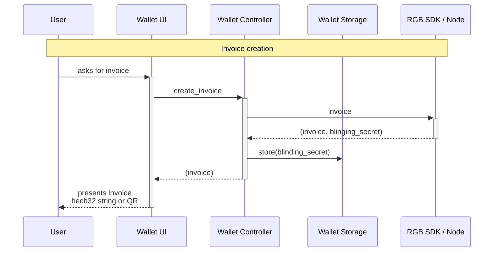
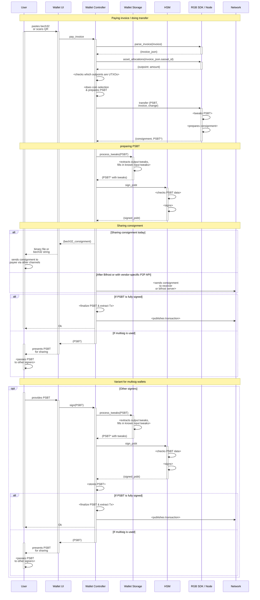
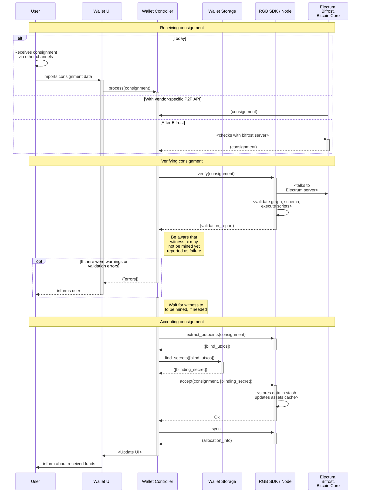

```mermaid
sequenceDiagram
    participant User
    participant UI as Wallet UI
    participant Wallet as Wallet Controller
    participant Storage as Wallet Storage
    participant RGB as RGB SDK / Node

    Note over User, RGB: Invoice creation

    User ->> +UI: asks for invoice
    UI ->> +Wallet: create_invoice
    Wallet ->> +RGB: invoice
    RGB -->> -Wallet: (invoice, blinging_secret)
    Wallet ->> Storage: store(blinding_secret)
    Wallet -->> -UI: (invoice)
    UI -->> -User: presents invoice<br>bech32 string or QR
```

```mermaid
sequenceDiagram
    participant User
    participant UI as Wallet UI
    participant Wallet as Wallet Controller
    participant Storage as Wallet Storage
    participant HSM
    participant RGB as RGB SDK / Node
    participant Network

    Note over User, Network: Paying invoice / doing transfer

    User ->> +UI: pastes bech32 <br> or scans QR
    activate User
    UI ->> +Wallet: pay_invoice
    Wallet ->> +RGB: parse_invoice(invoice)
    RGB -->> -Wallet: (invoice_json)
    Wallet ->> +RGB: asset_allocations(invoice_json.sasset_id)
    RGB -->> -Wallet: (outpoint: amount)
    Wallet ->> Wallet: <checks which outpoints are UTXOs>
    Wallet ->> Wallet: <does coin selection <br> & prepares PSBT
    Wallet ->> +RGB: transfer (PSBT, <br>invoice, change)
    RGB ->> RGB: <tweaks PSBT>
    RGB ->> RGB: <prepares consignment>
    RGB -->> -Wallet: (consignment, PSBT*)

    Note over User, Network: preparing PSBT
    Wallet ->> +Storage: process_tweaks(PSBT)
    Storage ->> Storage: <extracts output tweaks,<br>fills in known input tweaks>
    Storage -->> -Wallet: (PSBT* with tweaks)
    Wallet ->> +HSM: sign_psbt
    HSM ->> HSM: <checks PSBT data>
    HSM ->> HSM: <signs>
    HSM -->> -Wallet: (signed_psbt)

    Note over User, Network: Sharing consignment

    alt Sharing consignment today
        Wallet -->> UI: (bech32_consignment)
        UI -->> User: binary file or<br>bech32 string
        User ->> User: sends consignment to<br>payee via other channels
    else After Bifrost or with vendor-specific P2P API
        Wallet ->> Network: <sends consignment<br>to receiver<br>or bifrost server>
    end
    alt If PSBT is fully signed
        Wallet ->> Wallet: <finalize PSBT & extract Tx>
        Wallet ->> Network: <publishes transaction>
        Wallet -->> User: Ok
        deactivate User
    else If multisig is used
        Wallet -->> -UI: (PSBT)
        activate User
        UI -->> -User: presents PSBT<br>for sharing
        User ->> User: <passes PSBT<br>to other signers>
        deactivate User
    end

    Note over User, Network: Variant for multisig wallets

    opt Other signers
        activate User
        User ->> +UI: provides PSBT
        UI ->> +Wallet: sign(PSBT)
        Wallet ->> +Storage: process_tweaks(PSBT)
        Storage ->> Storage: <extracts output tweaks,<br>fills in known input tweaks>
        Storage -->> -Wallet: (PSBT* with tweaks)
        Wallet ->> +HSM: sign_psbt
        HSM ->> HSM: <checks PSBT data>
        HSM ->> HSM: <signs>
        HSM -->> -Wallet: (signed_psbt)
        Wallet ->> Wallet: <stores PSBT>
        alt If PSBT is fully signed
            Wallet ->> Wallet: <finalize PSBT & extract Tx>
            Wallet ->> Network: <publishes transaction>
            Wallet -->> User: Ok
            deactivate User
        else If multisig is used
            Wallet -->> -UI: (PSBT)
            activate User
            UI -->> -User: presents PSBT<br>for sharing
            User ->> User: <passes PSBT<br>to other signers>
            deactivate User
        end
    end

```

```mermaid
sequenceDiagram
    participant User
    participant UI as Wallet UI
    participant Wallet as Wallet Controller
    participant Storage as Wallet Storage
    participant RGB as RGB SDK / Node
    participant Network as Electum,<br>Bifrost,<br>Bitcoin Core

    Note over User, Network: Receiving consignment

    alt Today
        User ->> User: Receives consignment<br>via other channels
        User ->> +UI: imports consignment data
        UI ->> +Wallet: process(consignment)
    else With vendor-specific P2P API
        Network ->> Wallet: (consignment)
    else After Bifrost
        Wallet ->> +Network: <checks with bifrost server>
        Network -->> -Wallet: (consignment)
    end

    Note over User, Network: Verifying consignment
    Wallet ->> +RGB: verify(consignment)
    RGB ->> Network: <talks to<br>Electrum server>
    RGB ->> RGB: <validate graph, schema,<br>execute scripts>
    RGB -->> -Wallet: (validation_report)
    Note right of Wallet: Be aware that<br>witness tx may<br>not be mined yet<br>reported as failure
    opt If there were warnings or validation errors
        Wallet -->> -UI: ([errors])
        UI -->> -User: informs user
    end

    activate Wallet
    Note right of Wallet: Wait for witness tx<br>to be mined, if needed

    Note over User, Network: Accepting consignment
    Wallet ->> +RGB: extract_outpoints(consignment)
    RGB -->> -Wallet: ([blind_utxos])
    Wallet ->> +Storage: find_secrets([blind_utxos])
    Storage -->> -Wallet: ([blinding_secret])
    Wallet ->> +RGB: accept(consignment, [blinding_secret])
    RGB ->> RGB: <stores data in stash<br>updates assets cache>
    RGB -->> -Wallet: Ok
    Wallet ->> +RGB: sync
    RGB -->> -Wallet: (allocation_info)
    Wallet ->> -UI: <Update UI>
    UI ->> User: inform about received funds

```

TODO:
- Add `parse_invoice` function to RGB Core Lib & SDK
- Add `extract_outpoints` function to RGB Core Lib & SDK
- Modify` accept` function parameter to take an array of secrets
